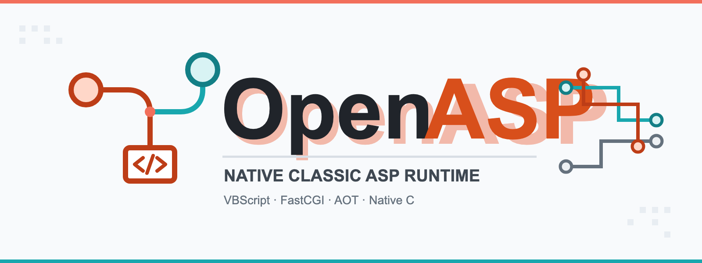
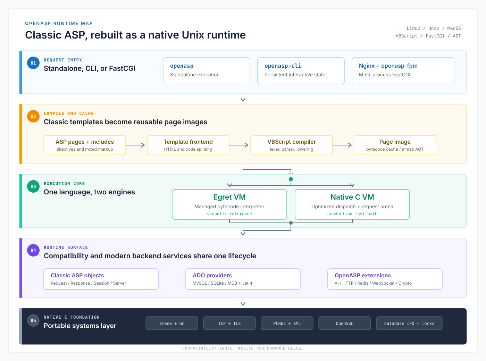

# OpenASP: Classic ASP for Linux, Unix, and MacOS

<p align="center" id="openasptop">
  
</p>

<p align="center">
  <a href="#build-from-source"></a>
  <a href="LICENSE"></a>
  <a href="#beyond-windows-and-iis"></a>
</p>

<p align="center">
  <a href="#install-a-binary-package">Install</a> |
  <a href="#build-from-source">Build</a> |
  <a href="#hello-world">Hello World</a> |
  <a href="#deploy-openasp-fpm-behind-a-web-server">Deployment</a> |
  <a href="#classic-asp-compatibility">Compatibility</a> |
  <a href="#openasp-extensions">Extensions</a> |
  <a href="#architecture">Architecture</a> |
  <a href="docs/OpenASP命令行.md">CLI</a> |
  <a href="https://openasp.dev">Website</a> |
  <a href="README.zh-CN.md">简体中文</a>
</p>

Official website: **[https://openasp.dev](https://openasp.dev)**. For questions, suggestions, or other feedback, please visit the website.

Classic ASP applications were historically tied to **Windows Server and IIS**.
OpenASP removes that platform lock-in, allowing existing VBScript and ASP
applications to run natively on **Linux, Unix, and MacOS** without requiring
Windows or IIS.

OpenASP combines an [Egret-based language](https://egret-lang.org) frontend with a native C runtime,
FastCGI serving, ADO-compatible data access, bytecode execution, and AOT mmap
loading. Compatibility and performance work stays inside the engine, so
application code does not need platform-specific workarounds.

Get started with a [binary package](#install-a-binary-package) or a
[source build](#build-from-source), then run the
[first ASP page](#hello-world) and place [`openasp-fpm` behind a web
server](#deploy-openasp-fpm-behind-a-web-server).

## Beyond Windows and IIS

| Traditional Classic ASP | OpenASP |
| --- | --- |
| Requires Windows Server | Runs on Linux, Unix, and MacOS |
| Hosted by IIS | Runs standalone or behind Nginx/FastCGI |
| Windows-oriented COM and ADO dependencies | Native C components and in-process database drivers |
| Platform migration requires application rewrites | Compatibility is implemented in the runtime |

## Install a Binary Package

Download the OpenASP 0.1.1 package for your operating system and CPU:

| Platform | Binary package |
| --- | --- |
| Linux x86-64 | [`openasp-0.1.1-linux-x86-64.tar.gz`](https://github.com/open-asp/openasp/releases/download/pre-release-0.1.1/openasp-0.1.1-linux-x86-64.tar.gz) |
| Linux ARM64 | [`openasp-0.1.1-linux-arm64.tar.gz`](https://github.com/open-asp/openasp/releases/download/pre-release-0.1.1/openasp-0.1.1-linux-arm64.tar.gz) |
| MacOS Apple Silicon | [`openasp-0.1.1-macos-arm64.zip`](https://github.com/open-asp/openasp/releases/download/pre-release-0.1.1/openasp-0.1.1-macos-arm64.zip) |

Each package contains three executables in its `bin/` directory:

- `openasp`: run an ASP page directly.
- `openasp-cli`: start the interactive command-line environment.
- `openasp-fpm`: run the FastCGI service.

After downloading, extract the package:

```sh
# Linux
tar -xzf openasp-0.1.1-linux-x86-64.tar.gz

# MacOS
unzip openasp-0.1.1-macos-arm64.zip
```

Add the extracted `bin/` directory to `PATH`:

```sh
export PATH="/path/to/openasp-0.1.1-linux-x86-64/bin:$PATH"
openasp --help
```

Use the corresponding directory name for Linux ARM64 or MacOS. Add the
`export` line to your shell profile to keep the setting after restarting the
terminal.

## Build from Source

OpenASP currently builds from source against an Egret compiler source tree.
The build creates a bootstrap compiler, patched runtime, native C libraries,
and the three OpenASP executables.

### Install the Egret compiler

Install Egret 0.1.6 before building OpenASP or `egret-web-server`. Published
toolchains are available from the
[egret-lang release directory](https://github.com/egret-lang/release/tree/main/egret-lang):

| Host | Package |
| --- | --- |
| MacOS Apple Silicon | `egret-0.1.6-aarch64-apple-darwin.zip` |
| Linux x86_64 | `egret-0.1.6-x86_64-unknown-linux-gnu.tar.gz` |
| Linux ARM64 | `egret-0.1.6-aarch64-unknown-linux-gnu.tar.gz` |

Download and extract the matching package, then set `EGRET_HOME` to the
extracted directory and add `$EGRET_HOME/bin` to `PATH`. Run `egret version`
to verify the installation.

The binary package provides the compiler and standard files. Building OpenASP
also requires the matching full Egret source tree; set `EGRET_ROOT` to that
source directory before running `make`.

### Linux dependencies

Ubuntu 24.04:

```sh
sudo apt-get update
sudo apt-get install -y \
    bison build-essential ca-certificates clang curl file flex \
    libglib2.0-dev libpcre2-dev libssl-dev libsqlite3-dev \
    libxml2-dev libzstd-dev lld llvm-dev mdbtools mdbtools-dev \
    nasm patch pkg-config python3 zlib1g-dev
```

Other Linux and Unix distributions need equivalent packages. In particular,
the linker requires static `libmdb`, `libmdbsql`, SQLite, PCRE2, OpenSSL
Crypto, and zlib libraries, together with a C11 compiler and LLVM toolchain.

### MacOS dependencies

Install the Xcode command-line tools and Homebrew packages:

```sh
xcode-select --install
brew install \
    bison flex glib libiconv libxml2 llvm lld mdbtools nasm \
    openssl@3 pcre2 pkg-config python sqlite zstd

export PATH="$(brew --prefix bison)/bin:$(brew --prefix flex)/bin:$PATH"
```

The MacOS build links GNU `libiconv` and `libcharset` statically. On a
nonstandard Homebrew prefix, pass `GNU_ICONV_PREFIX="$(brew --prefix libiconv)"`
to `make`.

### Build

Set `EGRET_ROOT` to an Egret source checkout containing `egret/`, `compiler/`,
`runtime/`, and `include/`, then build:

```sh
export EGRET_ROOT=/path/to/egret
make clean
make EGRET_ROOT="$EGRET_ROOT" build
```

Build artifacts are written to `build/`:

| Program | Purpose |
| --- | --- |
| `openasp` | Render or compile ASP pages directly |
| `openasp-cli` | Interactive environment with persistent Session/Application state |
| `openasp-fpm` | FastCGI service for Nginx and other gateways |

If a library is installed outside the paths reported by `pkg-config`, use the
Makefile overrides `MDBTOOLS_PREFIX`, `SQLITE_PREFIX`, `OPENSSL_PREFIX`,
`GNU_ICONV_PREFIX`, or `PCRE2_LIBDIR`.

## Hello World

Create `/tmp/openasp-site/default.asp`:

```asp
<%@ Language=VBScript %>
<%
Response.ContentType = "text/html; charset=utf-8"
Dim name
name = Request.QueryString("name")
If name = "" Then name = "World"
%>
<!doctype html>
<html>
<head><meta charset="utf-8"><title>OpenASP</title></head>
<body><h1>Hello, <%= Server.HTMLEncode(name) %>!</h1></body>
</html>
```

Render it directly, without a web server:

```sh
mkdir -p /tmp/openasp-site
build/openasp /tmp/openasp-site/default.asp \
    --root /tmp/openasp-site \
    --query "name=OpenASP"
```

`openasp` accepts the following request and runtime options:

| Option | Meaning |
| --- | --- |
| `<page.asp>` or `--file <page.asp>` | ASP entry file |
| `--root <dir>` | Site root; defaults to the entry file's directory |
| `--query <a=1>` | URL-encoded query string |
| `--body <x=1>` | Request body |
| `--method <GET\|POST>` | HTTP method; defaults to `GET` |
| `--session <id>` | Explicit Session ID for repeated local calls |
| `--log-file <path\|off>` | Log base path, or disable file logging |
| `--log-level <level\|off>` | `info`, `notice`, `warn`, `error`, or `off` |
| `--shell-enable=on` | Enable privileged `Shell.Application`; off by default |
| `--process-enable=on` | Enable privileged `OpenASP.Process`; off by default |

`openasp-cli --root /path/to/site` starts an interactive VBScript environment.
Variables, `Session`, and `Application` survive between commands; use
`--no-prompt` for scripted input.

## Deploy openasp-fpm behind a web server

### 1. Start OpenASP FastCGI

```sh
build/openasp-fpm \
    --root /srv/www/example \
    --unix-socket /run/openasp/openasp.sock \
    --workers 4 \
    --worker-connections 128 \
    --max-accepts 1000 \
    --log-file /var/log/openasp/fpm.log \
    --log-level info
```

| Option | Default | Meaning |
| --- | --- | --- |
| `--root <dir>` | `.` | Physical site root |
| `--unix-socket <path>` | disabled | Listen on a Unix socket with mode `0660` |
| `--host <address>` | `127.0.0.1` | FastCGI listen address |
| `--port <port>` | `9000` | FastCGI TCP port |
| `--workers <n>` | `2` | Worker processes |
| `--worker-connections <n>` | `128` | Concurrent FastCGI connections per worker |
| `--max-accepts <n>` | `0` | Recycle a worker after `n` accepted connections; `0` disables recycling |
| `--aot=on\|off` | `on` | Enable mmap-backed AOT page images |
| `--log-file <path\|off>` | `logs/openasp-fpm.log` | Daily log base path |
| `--log-level <level\|off>` | `info` | Log threshold |
| `--shell-enable=on` | `off` | Enable `Shell.Application` |
| `--process-enable=on` | `off` | Enable `OpenASP.Process` |

Log filenames receive a `-YYYYMMDD` suffix. The parent directory is created
automatically. Query strings, bodies, cookies, Session values, and OpenAI API
keys are not written to request logs.

Create the Unix socket's parent directory before startup. To use TCP instead,
omit `--unix-socket` and pass `--host` and `--port`; the two modes cannot be
combined.

### 2A. Configure Nginx

Create `/etc/nginx/conf.d/openasp.conf`:

```nginx
server {
    listen 8080;
    server_name _;
    root /srv/www/example;
    index default.asp;

    client_max_body_size 32m;

    location / {
        try_files $uri $uri/ /default.asp?$query_string;
    }

    location ~ \.asp$ {
        try_files $uri =404;
        include /etc/nginx/fastcgi_params;

        fastcgi_param SCRIPT_FILENAME $document_root$fastcgi_script_name;
        fastcgi_param SCRIPT_NAME     $fastcgi_script_name;
        fastcgi_param DOCUMENT_ROOT   $document_root;
        fastcgi_param PATH_INFO       "";
        fastcgi_param PATH_TRANSLATED $document_root$fastcgi_script_name;

        fastcgi_pass unix:/run/openasp/openasp.sock;
        fastcgi_read_timeout 120s;
    }

    location ~* \.(asa|inc)$ {
        deny all;
    }
}
```

On Homebrew Nginx, the include is normally
`/opt/homebrew/etc/nginx/fastcgi_params`. The Nginx `root` and
`openasp-fpm --root` must identify the same directory; the FastCGI
`SCRIPT_FILENAME` is the authoritative physical ASP path.

Validate, reload, and request the page:

```sh
sudo nginx -t
sudo nginx -s reload
curl 'http://127.0.0.1:8080/?name=OpenASP'
```

Keep FastCGI bound to loopback unless a private gateway network is required.
Run the selected web server and `openasp-fpm` under unprivileged service
accounts with read access to the site and write access only to intended upload,
state, cache, and log directories. Leave shell and process execution disabled
for ordinary sites. Use a service manager such as systemd or launchd to
supervise both processes in production.

### 2B. Configure egret-web-server

[`egret-web-server`](https://github.com/egret-lang/egret-web-server) is an
Egret-native alternative to Nginx. It supports Nginx-style server/location
blocks, `try_files`, TCP or Unix-socket `fastcgi_pass`, `fastcgi_param`,
multi-process workers, AIO connections, gzip, TLS, and reverse proxying.

Build it with Egret 0.1.4 or later:

```sh
git clone https://github.com/egret-lang/egret-web-server.git
cd egret-web-server
egret build
mkdir -p logs
```

Create `conf/openasp.conf`:

```nginx
worker_processes 4;
error_log ./logs/error.log;

events {
    worker_connections 1024;
}

http {
    access_log ./logs/access.log;
    default_type application/octet-stream;
    keepalive_timeout 65;
    client_max_body_size 32m;

    server {
        listen 8080;
        server_name localhost;
        root /srv/www/example;
        index default.asp;

        location / {
            try_files $uri $uri/ /default.asp?$query_string;
        }

        location ~ \.asp$ {
            fastcgi_pass unix:/run/openasp/openasp.sock;
            fastcgi_index default.asp;

            fastcgi_param SCRIPT_FILENAME $document_root$fastcgi_script_name;
            fastcgi_param SCRIPT_NAME     $fastcgi_script_name;
            fastcgi_param QUERY_STRING    $query_string;
            fastcgi_param REQUEST_METHOD  $request_method;
            fastcgi_param CONTENT_TYPE    $content_type;
            fastcgi_param CONTENT_LENGTH  $content_length;
            fastcgi_param REQUEST_URI     $request_uri;
            fastcgi_param DOCUMENT_ROOT   $document_root;
            fastcgi_param SERVER_PROTOCOL $server_protocol;
            fastcgi_param REMOTE_ADDR     $remote_addr;
            fastcgi_param REMOTE_PORT     $remote_port;
            fastcgi_param SERVER_ADDR     $server_addr;
            fastcgi_param SERVER_PORT     $server_port;
            fastcgi_param SERVER_NAME     $server_name;
            fastcgi_param HTTP_COOKIE     $http_cookie;
        }
    }
}
```

Start the same `openasp-fpm` command from step 1, then start the web server:

```sh
./build/egret-web-server -c ./conf/openasp.conf --check-config
./build/egret-web-server -c ./conf/openasp.conf
curl 'http://127.0.0.1:8080/?name=OpenASP'
```

The `root` in `openasp.conf` must match `openasp-fpm --root`. The gateway
already supplies a baseline CGI/1.1 environment; the explicit parameters make
the ASP mapping visible and keep this configuration portable. Keep port 9000
on loopback and apply the same service-account and filesystem restrictions
described above.

## Highlights

| Area | Implementation |
| --- | --- |
| VBScript | Lexer, parser, classes, arrays, error handling, `ByRef`, and `On Error Resume Next` |
| ASP runtime | `Request`, `Response`, `Server`, `Session`, and `Application` |
| Data access | `OpenASP.MySQL`, `OpenASP.SQLite`, and `OpenASP.MDB` |
| MDB / Jet 4 | Native DDL/DML, process locking, journaling, and crash recovery without Java |
| Execution | Egret VM, native C VM, and mmap-backed AOT page images |
| Service modes | Standalone rendering, stateful CLI, and multi-process FastCGI |
| Native components | HTTP, WebSocket, Socket, Redis, Memcache, JSON, Crypto, and OpenAI |
| Memory | Request arenas, GC safepoints, conservative-root validation, and idle pressure collection |

## Classic ASP Compatibility

OpenASP implements the Classic ASP object model directly on Unix-like systems:

| Surface | Supported capabilities |
| --- | --- |
| Built-in objects | `Request`, `Response`, `Server`, `Session`, `Application`, `ObjectContext` |
| Request data | Query string, form body, cookies, server variables, headers, and `BinaryRead` |
| Response control | Buffered output, headers, cookies, status, redirect, text and binary writes |
| Server helpers | `CreateObject`, `MapPath`, `HTMLEncode`, `URLEncode`, script timeout |
| VBScript | Procedures, classes, arrays, `ByRef`, error handling, `On Error Resume Next`, built-ins |
| Includes | Classic `<!--#include file=... -->` and virtual include processing |

Windows-oriented ProgIDs are implemented by portable runtime components:

| Compatible ProgID | Capability |
| --- | --- |
| `Scripting.Dictionary` | Key/value collections with default `Item` |
| `ADODB.Connection`, `Recordset`, `Command` | SQL execution, parameters, cursors, fields, paging, transactions |
| `ADODB.Stream` | Binary/text streams, charset conversion, file load/save |
| `Scripting.FileSystemObject` | Files, folders, text streams, and collections |
| `VBScript.RegExp` | PCRE2-backed matching, captures, replacement, and submatches |
| `MSXML2.DOMDocument` and aliases | XML load, parse, select, mutate, and save |
| `MSXML2.ServerXMLHTTP`, `MSXML2.XMLHTTP` | HTTP/HTTPS client compatibility |
| `Shell.Application` | Process launch compatibility; disabled unless explicitly enabled |

ADO uses native providers selected by the connection string:

```asp
<%
Set db = Server.CreateObject("ADODB.Connection")
db.Open "Provider=OpenASP.SQLite;Data Source=/srv/www/example/data/site.db"

Set rows = db.Execute("SELECT id, title FROM posts ORDER BY id DESC")
Do Until rows.EOF
    Response.Write Server.HTMLEncode(rows("title")) & "<br>"
    rows.MoveNext
Loop
%>
```

| Provider | Connection string |
| --- | --- |
| `OpenASP.MySQL` | `Provider=OpenASP.MySQL;Server=127.0.0.1;Port=3306;User Id=user;Password=secret;Database=app;Charset=utf8mb4` |
| `OpenASP.SQLite` | `Provider=OpenASP.SQLite;Data Source=/absolute/path/app.db` |
| `OpenASP.MDB` | `Provider=OpenASP.MDB;Data Source=/absolute/path/data.mdb` |

MDB/Jet 4 support includes native reads, DDL/DML, AutoNumber handling,
multi-process locking, journaling, and crash recovery without Java or Access.

## OpenASP Extensions

Create extensions with `Server.CreateObject("OpenASP.Name")`. ProgIDs are
case-insensitive. Live sockets and connections belong to the request context
and are closed deterministically when the request ends.

| Component | Main capabilities |
| --- | --- |
| `OpenASP.JSON` | `Parse`, `Stringify`, `Validate`, `Minify`, `Escape`; parsed objects expose `Item`, `Exists`, `Count`, `Keys`, `Items` |
| `OpenASP.HttpClient` | `Get`, `Post`, `Send`, custom headers, status/response access, timeout/body limits, TLS verification and private CA files |
| `OpenASP.WebSocket` | `ws://`/`wss://` client and server upgrade, text/binary frames, Ping/Pong, close metadata and subprotocols |
| `OpenASP.Socket` | TCP, UDP, and Unix sockets; connect/listen/accept, send/receive, datagrams, addresses, ports, state and timeouts |
| `OpenASP.Redis` | RESP connection/auth/database selection, common string/hash/list/set methods, and arbitrary `Execute` commands |
| `OpenASP.Memcache` | Text, meta, and binary protocols; get/store/CAS/counters/stats, optional TLS and private CA files |
| `OpenASP.Crypto` | SHA-256, HMAC-SHA256, Base64/Base64URL, CSPRNG bytes/hex, constant-time comparison |
| `OpenASP.Process` | Bounded synchronous execution, managed child lifecycle, and standalone POSIX fork/wait/signal APIs |
| `OpenASP.OpenAI` | OpenAI-compatible Chat Completions and Responses APIs with configurable model, endpoint, timeout, and body limit |

### OpenASP.JSON

`OpenASP.JSON` parses JSON into VBScript-compatible objects and arrays and
serializes them back without a scripting-language JSON shim. Object keys are
case-sensitive. `Validate` and `Minify` stay in native code and avoid building
an object graph when a gateway only needs to check or forward a payload.

```asp
<%
Response.ContentType = "application/json"
Set json = Server.CreateObject("OpenASP.JSON")

payload = "{""requestId"":""req-42"",""items"":[1,2,3]," & _
          """metadata"":{""source"":""classic-asp""}}"

If Not json.Validate(payload) Then
    Response.Status = "400 Bad Request"
    Response.Write "{""error"":""invalid JSON""}"
    Response.End
End If

Set document = json.Parse(payload)
Set metadata = document("metadata")
metadata("processed") = True

Response.Write json.Stringify(document)
%>
```

Public methods are `Parse`, `Stringify`, `Validate`, `Minify`, and `Escape`.
Parsed objects expose default `Item`, `Exists`, `Count`, `Keys`, and `Items`;
arrays use normal VBScript indexing. The native validator caps nesting at 128.

### OpenASP.HttpClient

`OpenASP.HttpClient` is a synchronous HTTP/HTTPS client for calling REST APIs
and internal services. It enforces absolute URLs, response limits, timeouts,
CR/LF-safe headers, certificate-chain verification, and hostname verification.

```asp
<%
Set http = Server.CreateObject("OpenASP.HttpClient")
http.Timeout = 10000
http.MaxResponseBytes = 1048576
http.TLSVerify = True
http.CAFile = "/etc/ssl/private-service-ca.pem"

Call http.SetHeader("Accept", "application/json")
Call http.SetHeader("Content-Type", "application/json")
body = http.Post( _
    "https://service.example/v1/items", _
    "{""name"":""OpenASP"",""enabled"":true}" _
)

Response.ContentType = "application/json"
If http.Status >= 200 And http.Status < 300 Then
    Response.Write body
Else
    Response.Status = "502 Bad Gateway"
    Response.Write "{""upstreamStatus"":" & http.Status & "}"
End If

Call http.ClearHeaders()
%>
```

Use `Get(url)`, `Post(url, body)`, or `Send(method, url, body)`.
`Status`, `ResponseText`/`ResponseBody`, `ResponseHeaders`, and
`GetResponseHeader(name)` expose the response. The default timeout is 30
seconds and the default maximum response is 16 MiB.

### OpenASP.WebSocket

`OpenASP.WebSocket` provides `ws://` and `wss://` clients as well as
server-side upgrades from an accepted `OpenASP.Socket`. Client frames are
masked automatically; Ping frames receive automatic Pong replies.

```asp
<%
Set ws = Server.CreateObject("OpenASP.WebSocket")
ws.Timeout = 15000
ws.TLSVerify = True
' ws.CAFile = "/etc/ssl/private-service-ca.pem"

Call ws.Connect("wss://service.example/events", "json")
Call ws.SendText("{""type"":""ping"",""id"":42}")
message = ws.Receive()

Response.ContentType = "application/json"
Set json = Server.CreateObject("OpenASP.JSON")
Response.Write "{""state"":" & ws.State & _
    ",""messageType"":""" & ws.MessageType & """" & _
    ",""payload"":""" & json.Escape(message) & """}"

Call ws.Close()
%>
```

The full frame API is `SendText`, `SendBinary`, `Receive`/`Recv`, `Ping`,
`Pong`, and `Close`. Inspect `State`, `MessageType`, `Opcode`, `Final`,
`CloseCode`, and `Subprotocol`. For a server, call
`ws.Accept(acceptedSocket, subprotocol)`; ownership of that socket moves to the
WebSocket object.

### OpenASP.Socket

`OpenASP.Socket` exposes TCP, UDP, and Unix domain sockets. It can act as a
client, a TCP/Unix listener, or a UDP endpoint. The following complete TCP
client expects an echo service on `127.0.0.1:9001`:

```asp
<%
Set socket = Server.CreateObject("OpenASP.Socket")
socket.Protocol = "tcp"
socket.Timeout = 5000

Call socket.Connect("127.0.0.1", 9001)
sent = socket.Send("hello from OpenASP")
reply = socket.Receive(4096)

Response.ContentType = "text/plain"
Response.Write "state=" & socket.State & vbCrLf
Response.Write "bytes-sent=" & sent & vbCrLf
Response.Write "reply=" & reply

Call socket.Close()
%>
```

TCP/Unix servers use `Listen` and `Accept`; UDP uses `Bind`, `SendTo`, and
`ReceiveFrom`. `ReceiveFrom` returns `[data, peerHost, peerPort]`. Configuration
and metadata include `Protocol`, `Host`/`Address`/`Path`, `Port`, `Timeout`,
`State`, `LocalAddress`, `RemoteAddress`, and `LastPeerAddress`.

### OpenASP.Redis

`OpenASP.Redis` speaks RESP directly and preserves Null, integer, boolean, and
array reply types. It accepts either individual connection arguments or a
connection string and closes the live connection at request teardown.

```asp
<%
Set redis = Server.CreateObject("OpenASP.Redis")
Call redis.Open( _
    "Server=127.0.0.1;Port=6379;Database=0;Timeout=5000" _
)

Call redis.SetEx("session:42", "active", 60)
Call redis.HSet("user:42", "name", "OpenASP")
Call redis.Del("jobs:pending")
Call redis.RPush("jobs:pending", "compile")
Call redis.RPush("jobs:pending", "deploy")

jobs = redis.LRange("jobs:pending", 0, -1)
Response.ContentType = "text/plain"
Response.Write redis.Get("session:42") & vbCrLf
Response.Write redis.HGet("user:42", "name") & vbCrLf
Response.Write Join(jobs, ",")

Call redis.Del("session:42", "user:42", "jobs:pending")
Call redis.Close()
%>
```

Convenience methods cover strings (`Get`, `Set`, `SetEx`, `Del`, `Exists`,
`Expire`, `TTL`, `Incr`, `Decr`), hashes (`HGet`, `HSet`, `HGetAll`), lists
(`LPush`, `RPush`, `LPop`, `RPop`, `LRange`), and sets (`SAdd`, `SMembers`).
`Ping`, `Auth`, and `Select` manage the connection;
`Execute(command, ...)` sends commands not covered by helpers.

### OpenASP.Memcache

`OpenASP.Memcache` supports text, meta, and binary protocols, including CAS,
counters, statistics, and optional TLS. Values use length-aware strings, so
embedded `0x00` bytes are retained.

```asp
<%
Set cache = Server.CreateObject("OpenASP.Memcache")
cache.Host = "127.0.0.1"
cache.Port = 11211
cache.Protocol = "text"
cache.Timeout = 5000
Call cache.Open()

Call cache.Set("page:home", "<h1>OpenASP</h1>", 0, 60)
cached = cache.Get("page:home")

If IsNull(cached) Then
    Response.Status = "404 Not Found"
Else
    Response.Write cached
End If

Call cache.Delete("page:home")
Call cache.Close()
%>
```

Storage operations are `Set`, `Add`, `Replace`, `Append`, `Prepend`, and
`CAS`; mutation operations are `Delete`, `Touch`, `Incr`, and `Decr`.
`Get`/`Gets`, `LastFlags`, and `LastCAS` expose retrieved metadata.
`Stats`, `Version`, and `FlushAll` provide management operations.

### OpenASP.Crypto

`OpenASP.Crypto` uses OpenSSL primitives for hashing, signatures, encoding,
cryptographically secure random values, and timing-safe comparisons. Binary
inputs and outputs retain embedded zero bytes.

```asp
<%
Set crypto = Server.CreateObject("OpenASP.Crypto")

token = crypto.Base64URLEncode(crypto.RandomBytes(32))
signature = crypto.HMACSHA256("replace-with-server-secret", token)
expected = crypto.HMACSHA256("replace-with-server-secret", token)

Response.ContentType = "text/plain"
Response.Write "token=" & token & vbCrLf
Response.Write "sha256=" & crypto.SHA256("OpenASP") & vbCrLf
Response.Write "signature-valid=" & _
    CStr(crypto.ConstantTimeEquals(signature, expected))
%>
```

Methods are `SHA256`, `HMACSHA256`, `Base64Encode`/`Base64Decode`,
`Base64URLEncode`/`Base64URLDecode`, `RandomBytes`, `RandomHex`, and
`ConstantTimeEquals`. SHA-256 and HMAC results are lowercase hexadecimal.

### OpenASP.Process

`OpenASP.Process` executes an explicit program without implicitly passing the
command through a shell. Output and runtime are bounded, and timeouts terminate
the child process group. This capability is disabled by default; start the host
with `--process-enable=on` only for trusted applications.

```asp
<%
Set process = Server.CreateObject("OpenASP.Process")
process.Timeout = 5000
process.MaxOutputBytes = 65536

Set result = process.Run( _
    "/usr/bin/uname", "-a", "/", "", 5000, 65536 _
)

Response.ContentType = "text/plain"
Response.Write "exit=" & result.ExitCode & vbCrLf
Response.Write "timed-out=" & result.TimedOut & vbCrLf
Response.Write "stdout=" & result.StdOut & vbCrLf
Response.Write "stderr=" & result.StdErr
%>
```

`Run` is synchronous. `Start`, `PID`, `IsRunning`, `Wait`, and `Terminate`
manage a longer-lived child. Low-level `Fork`, `WaitPid`, `Signal`, and `Exit`
are only valid during single-threaded standalone startup and are forbidden in
FPM request handling. `OpenASP.Process` and `Shell.Application` have separate
permission switches.

### OpenASP.OpenAI

`OpenASP.OpenAI` calls OpenAI-compatible model services without a bridge
process. `BaseURL` may point to OpenAI or a compatible local/private service.
Plain strings produce a minimal request; valid JSON is forwarded unchanged for
tools, multimodal input, structured output, or provider-specific fields.

```asp
<%
Set ai = Server.CreateObject("OpenASP.OpenAI")
ai.APIKey = Application("OPENAI_API_KEY")
ai.BaseURL = "https://api.openai.com/v1"
ai.Model = "gpt-4o-mini"
ai.Timeout = 120000
ai.MaxResponseBytes = 16777216

raw = ai.Responses("Summarize this Classic ASP application.")

Response.ContentType = "application/json"
If ai.Status >= 200 And ai.Status < 300 Then
    Set json = Server.CreateObject("OpenASP.JSON")
    Set result = json.Parse(raw)
    Response.Write json.Stringify(result)
Else
    Response.Status = "502 Bad Gateway"
    Response.Write "{""modelServiceStatus"":" & ai.Status & "}"
End If
%>
```

`ChatCompletions(promptOrJson)` posts to `/chat/completions`, while
`Responses(inputOrJson)` posts to `/responses`. `Status` and `LastResponse`
expose the latest call. Load API keys through the deployment secret mechanism;
never place them in source, query strings, or response bodies. OpenASP does not
write the key to request logs.

See the [backend component reference](docs/OpenASP后端组件.md) for exact
signatures, limits, TLS behavior, and lifecycle rules.

## Architecture



Requests enter through standalone execution, the stateful CLI, an embedding
host, or the `openasp-fpm` worker pool behind Nginx. ASP templates and includes
are lowered by the VBScript frontend into cached bytecode or mmap-backed AOT
page images. The Egret VM and native C VM share the same ASP object model, ADO
providers, extension registry, request state, logging, arena, and GC services.

Repository layout:

| Path | Responsibility |
| --- | --- |
| `src/asp/compiler/` | ASP template preprocessing and the VBScript frontend |
| `src/asp/vm/` | Bytecode, interpreter, and VM dispatch |
| `src/asp/runtime/` | Variants, request state, caches, and serialization |
| `src/asp/object/` | ASP, ADO, and backend component object models |
| `src/asp/server/` | FastCGI protocol, process model, and request mapping |
| `native/` | Native database, GC, C VM, system, and text implementations |
| `fixtures/pages/` | Semantic and component regression pages |
| `tests/` | Native, concurrency, and integration tests |

## Verification

```sh
make test-source-paths
make test-openasp-commands
make test-vbscript-bnf
make test-backend-components
make test-mdb-native
```

Native C modules are built with `-Wall -Wextra -Werror`. MDB regressions cover
DDL/DML, multi-process concurrency, AutoNumber uniqueness, forced crash
recovery, and data consistency.

## Documentation

The detailed engineering documentation is currently maintained in Chinese:

- [OpenASP CLI](docs/OpenASP命令行.md)
- [OpenASP backend components](docs/OpenASP后端组件.md)
- [VBScript BNF support matrix](docs/VBSCRIPT_BNF_SUPPORT.md)
- [Classic ASP feasibility and design](docs/classic-asp-feasibility-and-design.md)
- [AOT memory optimization](docs/AOT_MEMORY_OPTIMIZATION.md)
- [Running Z-Blog locally](docs/ZBlog本地运行.md)
- [Native module layout](native/README.md)
